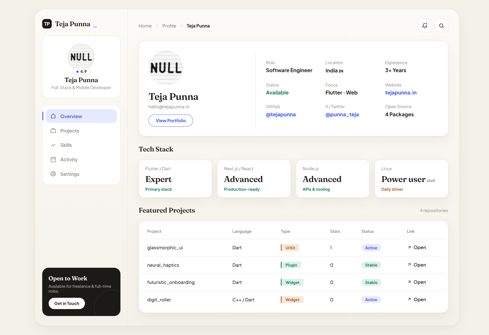

  

 

### 📦 Featured Projects

| Project | Language | Type | Status |
|---|---|---|---|
| **[glassmorphic_ui](https://github.com/tejapunna/glassmorphic_ui)** | Dart | UI Kit | Active |
| **[neural_haptics](https://github.com/tejapunna/neural_haptics)** | Dart | Plugin | Stable |
| **[futuristic_onboarding](https://github.com/tejapunna/futuristic_onboarding)** | Dart | Widget | Stable |
| **[digit_roller](https://github.com/tejapunna/digit_roller)** | C++ / Dart | Widget | Active |

 

